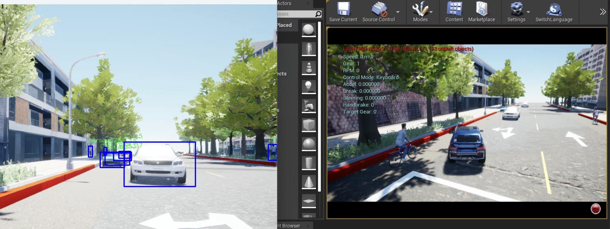

# Data Augmentation for object detection in virtual environment
## Introduction

we proposed a method to expand the data and real-time training architecture through VR to improve the accuracy of the model and reduce labor costs and time consumed.

In addition, it can also complete labeling tasks rapidly, and even 3D object detection can be quickly obtained.


## Installation
### Development environment
  
 
 
 
### Device
- GPU : RTX 3090
- CPU : i9-12900
- RAM : 32 GB

### Installation steps
1. Download [Unreal](https://www.unrealengine.com/en-US/download) ```4.27.X```
2. Download [Airsim](https://github.com/Microsoft/AirSim) ```1.6```
### Download repository
 ```
git clone https://github.com/WeiXuanYou/Reinforcement-Learning-for-Object-Detection-in-Unreal.git
cd Reinforcement-Learning-for-Object-Detection-in-Unreal
git submodule init
git submodule update
```
###  Download a pretrained model from YOLOv7
```
wget https://github.com/WongKinYiu/yolov7/releases/download/v0.1/yolov7.pt
```

## Traing
```
python train.py
```

## Demo
[](doc/img/demo.gif)

## Citation
## License
## Reference
